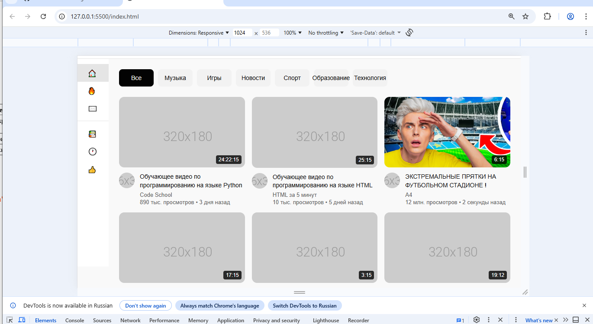
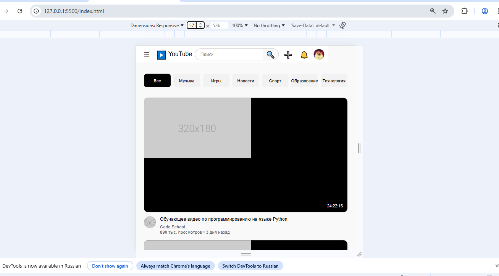

# YouTube Clone - Лабораторная работа №10-11
**Студент:**Богданов Иван Антонович и Шумила Дианочка Артемовна 
**Группа:** ИСП-233
---
## Описание
Адаптивный клон главной страницы YouTube, созданный с использованием HTML, CSS, Flexbox и CSS Grid. Проект полностью повторяет структуру оригинального сайта и корректно отображается на всех типах устройств.
---
## Реализованные функции
- [] Адаптивный хедер с поиском
- [] Боковая панель навигации
- [] Категории (чипсы) с интерактивностью
- [] Сетка видео с карточками
- [] Hover-эффекты на карточках
- [] Полная адаптивность под все устройства
- [] Кастомный скроллбар
---
## Технологии- 
- HTML5
- CSS3
- Flexbox
- CSS Grid
- Media Queries--
## Скриншоты
### Desktop (1920px)

### Tablet (1024px)

### Mobile (375px)

---
## Как запустить
1.Откройте файл `index.html`в браузере
2.Или используйте **Live Server** в VS Code:
- Установите расширение Live Server
- Правой кнопкой по `index.html` → Open with Live Server--
## Структура проекта
---
## Вывод
В ходе выполнения лабораторной работы мы изучили основы адаптивной вёрстки, освоили работу с Flexbox и CSS Grid, научились создавать интерактивные элементы с помощью CSS. Проект помог нам лучше понять принципы создания современных веб-интерфейсов.
---
## Дата выполнения
17.02.2026